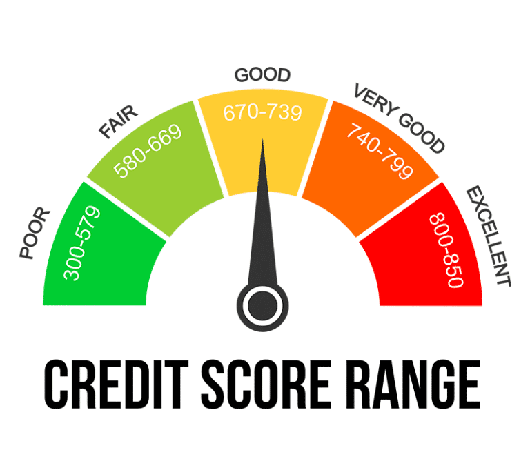

### `README.md`
```markdown
# Credit Score Checker

Credit Score Checker is a simple web application that allows users to input their credit score and receive feedback on whether it is bad, fair, good, or excellent. The application also provides relevant tips based on the entered credit score and includes a scale animation to enhance the user experience.

## Features

- Input field for entering a credit score
- Visual feedback indicating whether the score is bad, fair, good, or excellent
- Relevant tips provided based on the entered credit score
- Scale animation for visual enhancement
- Credit score range image for reference

## Project Structure

```
credit-score-checker/
├── index.html
├── styles.css
├── script.js
└── images/
    └── credit-score-range.png
```

## Setup and Usage

1. **Clone the repository:**

   ```sh
   git clone https://github.com/yourusername/credit-score-checker.git
   cd credit-score-checker
   ```

2. **Place the image:**
   
   Ensure the `credit-score-range.png` image is in the `images` directory within the project structure.

3. **Open the application:**

   Open the `index.html` file in your web browser to run the application.

## Files

- **index.html:** Contains the HTML structure of the application.
- **styles.css:** Contains the CSS styles for the application.
- **script.js:** Contains the JavaScript logic for checking the credit score and providing feedback.
- **images/credit-score-range.png:** The image showing the credit score range.

## How to Use

1. Open the `index.html` file in a web browser.
2. Enter your credit score in the input field provided.
3. Click the "Check" button to see the result and a relevant tip.
4. The result will indicate whether the credit score is bad, fair, good, or excellent.
5. A relevant tip will be displayed to help improve or maintain your credit score.

## Demo



## License

This project is licensed under the MIT License. See the [LICENSE](LICENSE) file for details.

## Contributing

If you would like to contribute to this project, please open an issue or submit a pull request.

## Contact

For any inquiries, please contact Harshil Shah at hshah1998@gmail.com
